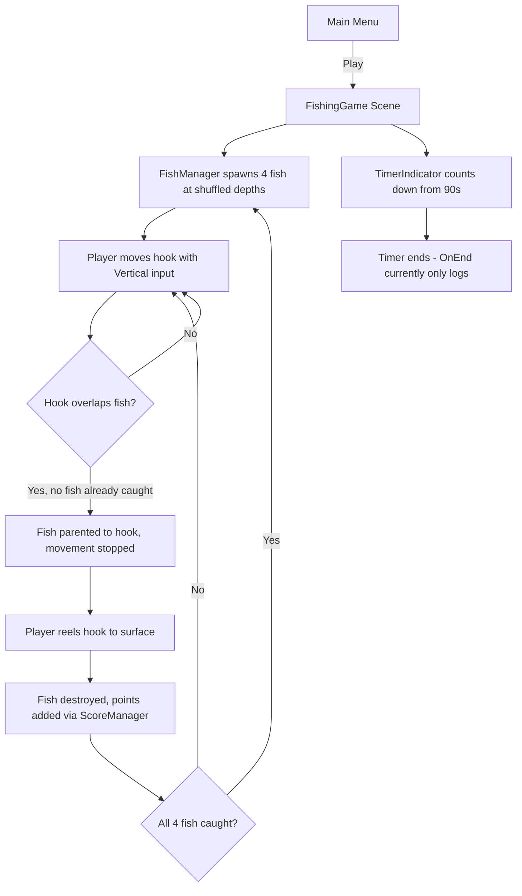

# M2M Fishing

A 2D fishing mini-game built in Unity for the **Muscle to Movement (M2M)** subteam of [UBC BEST](https://github.com/UBC-BEST) (UBC Biomedical Engineering Student Team). Players lower a fishing hook into the water, catch swimming fish, and reel them back to the surface to score points before time runs out.

This repository is intended as a foundation for future M2M rehabilitation games, similar in spirit to the archived [M2M-Golf](https://github.com/UBC-BEST/M2M-Golf) project. Input is currently keyboard-based (arrow keys / W-S), with the long-term goal of integrating M2M sensor hardware for therapeutic use.

---

## Table of Contents

- [Gameplay Overview](#gameplay-overview)
- [How a Round Works](#how-a-round-works)
- [Scoring](#scoring)
- [Tech Stack](#tech-stack)
- [Project Structure](#project-structure)
- [Getting Started](#getting-started)
- [Running the Game](#running-the-game)
- [Architecture](#architecture)
- [Key Scripts](#key-scripts)
- [Scene Setup Reference](#scene-setup-reference)
- [Configuration Guide](#configuration-guide)
- [Known Gaps and Tech Debt](#known-gaps-and-tech-debt)
- [Suggested Next Steps](#suggested-next-steps)
- [Contributing](#contributing)

---

## Gameplay Overview

The player controls a fishing hook attached to a line extending from a boat. Fish swim horizontally at various depths. The objective is to:

1. **Lower** the hook into the water.
2. **Catch** a fish by touching it with the hook (one fish at a time).
3. **Reel in** the hook to the surface to bank points.
4. **Repeat** until the round timer expires.

Fish depths are randomized each time all four fish are caught, so players cannot rely on fixed depth patterns.

### Controls

| Input | Action |
|-------|--------|
| **Up / W** | Raise the fishing hook |
| **Down / S** | Lower the fishing hook |

Input is read via Unity's default **Vertical** axis (`Input.GetAxis("Vertical")`).

---

## How a Round Works



---

## Scoring

Points are awarded when a caught fish reaches the surface (hook Y position >= line top). Values are determined by fish prefab name in `FishingLineLogic.GetFishValue()`:

| Fish | Prefab | Points |
|------|--------|--------|
| Fish 1 | `Assets/Prefabs/Fish 1.prefab` | 50 |
| Fish 2 | `Assets/Prefabs/Fish 2.prefab` | 30 |
| Fish 3 | `Assets/Prefabs/Fish 3.prefab` | 20 |
| Fish 4 | `Assets/Prefabs/Fish 4.prefab` | 10 |

**Important:** Prefab identity (Fish 1–4) determines point value. Spawn depth is shuffled independently by `FishManager`, so the most valuable fish is not always at the shallowest depth.

---

## Tech Stack

| Component | Version / Package |
|-----------|-------------------|
| **Unity** | 2022.3.20f1 (LTS) |
| **Render Pipeline** | Universal Render Pipeline (URP) 14.0.10 |
| **2D Feature Set** | `com.unity.feature.2d` 2.0.0 |
| **TextMeshPro** | 3.0.6 |
| **DOTween** | Bundled in `Assets/Plugins/Demigiant/DOTween/` |
| **Language** | C# |

---

## Project Structure

```
M2M-Fishing-Game-Unity/
├── Assets/
│   ├── Scenes/
│   │   ├── Menu.unity              # Main menu (entry point)
│   │   └── FishingGame.unity       # Core gameplay scene
│   ├── Prefabs/
│   │   ├── Fish 1.prefab … Fish 4.prefab
│   ├── Sprites/                    # Art assets (fish, boat, hook, background)
│   ├── Plugins/Demigiant/DOTween/  # Third-party tweening library
│   ├── Settings/                   # URP and 2D renderer settings
│   ├── Resources/                  # DOTween settings asset
│   └── *.cs                        # Game scripts (see Key Scripts below)
├── Packages/manifest.json          # Unity package dependencies
├── ProjectSettings/                # Unity project configuration
└── README.md
```

---

## Getting Started

### Prerequisites

- [Unity Hub](https://unity.com/download) with **Unity 2022.3.20f1** installed
- Git
- A C# IDE (Visual Studio, Rider, or VS Code with the [Unity extension](https://marketplace.visualstudio.com/items?itemName=visualstudiotoolsforunity.vstuc))

### Clone and Open

```bash
git clone https://github.com/UBC-BEST/M2M-Fishing-Game-Unity.git
cd M2M-Fishing-Game-Unity
```

1. Open **Unity Hub** → **Add** → select the cloned project folder.
2. Open the project with Unity **2022.3.20f1**.
3. Allow Unity to import assets on first launch (this generates `Library/` locally; it is gitignored).

### First-Time Editor Notes

- The solution file `M2M-Fishing-Game-Unity.sln` is auto-generated by Unity and is gitignored. Unity recreates it on open.
- DOTween is already included under `Assets/Plugins/`. No additional install step is required.
- If TextMeshPro prompts you to import essentials on first open, accept the import.

---

## Running the Game

1. Open `Assets/Scenes/Menu.unity`.
2. Press **Play** in the Unity Editor.
3. Click **Play** on the menu to load the fishing scene (build index + 1).
4. Use **Up/Down** or **W/S** to move the hook.

### Build Settings

Scenes in the player build (in order):

| Index | Scene | Enabled |
|-------|-------|---------|
| 0 | `Menu.unity` | Yes |
| 1 | `FishingGame.unity` | Yes |

Configured in `ProjectSettings/EditorBuildSettings.asset`. `MainMenu.PlayGame()` loads the next scene by build index.

---

## Architecture

The game uses a simple component-based architecture with a singleton score manager and scene-spawned fish instances.

```
Menu Scene                          FishingGame Scene
──────────                          ─────────────────
MainMenu                            FishManager ──────────► spawns Fish 1–4 prefabs
  └─ PlayGame() loads next scene         │
                                         ▼
                                    Fish1_0 (per fish)
                                      └─ DOTween horizontal swim + speed randomization

                                    fishingLine (FishingLineLogic)
                                      ├─ LineRenderer (visual line)
                                      └─ hook_0 (child transform)
                                            ├─ CircleCollider2D (trigger)
                                            └─ FishingHookCollision ◄── must be attached

                                    Score Timer (UI Canvas)
                                      ├─ ScoreManager (singleton)
                                      └─ TimerIndicator (countdown + fill bar)
```

### Core Game Loop

1. **`FishManager`** instantiates one of each fish prefab at randomized X positions and shuffled Y depths.
2. **`Fish1_0`** moves each fish horizontally using DOTween, flipping sprite direction at boundaries and randomizing swim speed periodically.
3. **`FishingLineLogic`** moves the hook on the Vertical axis, updates the `LineRenderer`, and scores fish when they reach the surface.
4. **`FishingHookCollision`** (on the hook) detects fish via `OnTriggerEnter2D`, parents the fish to the hook, and enforces the one-fish-at-a-time rule.
5. **`ScoreManager`** updates the on-screen score text.
6. **`TimerIndicator`** runs a 90-second countdown; when all four fish are destroyed, `FishManager` respawns a new set.

---

## Key Scripts

| Script | Location | Responsibility |
|--------|----------|----------------|
| `MainMenu.cs` | `Assets/` | Menu navigation: load next scene, quit application |
| `FishingLineLogic.cs` | `Assets/` | Hook movement, line rendering, surface scoring |
| `FishingHookCollision.cs` | `Assets/` | Trigger-based fish capture; one fish per cast |
| `FishManager.cs` | `Assets/` | Spawn, shuffle depths, respawn when all fish caught |
| `Fish1_0.cs` | `Assets/` | Fish movement (DOTween), flipping, speed variation |
| `ScoreManager.cs` | `Assets/` | Singleton score tracking and UI updates |
| `TimerIndicator.cs` | `Assets/` | Countdown timer with fill-bar UI |
| `Timer.cs` | `Assets/` | Alternate timer implementation (not wired in scene) |
| `FloatingGarbage.cs` | `Assets/` | Decorative bobbing motion (used on `trash_bag`) |
| `FishScript.cs` | `Assets/` | Empty stub — unused |
| `NewBehaviourScript.cs` | `Assets/` | Empty stub — safe to delete |

### Tags and Layers

- Fish prefabs must use the **`Fish`** tag (defined in `ProjectSettings/TagManager.asset`). `FishingHookCollision` and `FishingLineLogic` both check this tag.
- Sorting layers: `Background`, `Characters`, `UI`.

---

## Scene Setup Reference

### `Menu.unity`

- Canvas with **Play**, **Quit**, **Instructions**, and **Options** buttons.
- `MainMenu` component on a scene object; **Play** button calls `MainMenu.PlayGame()`.

### `FishingGame.unity`

Key GameObjects and their expected components:

| GameObject | Components |
|------------|------------|
| `FishManager` | `FishManager` — assign all four fish prefabs in Inspector |
| `fishingLine` | `LineRenderer`, `FishingLineLogic` — `fishingHook` ref → `hook_0` |
| `hook_0` | `SpriteRenderer`, `CircleCollider2D` (isTrigger), **`FishingHookCollision`** |
| `Score Timer` | `ScoreManager`, `TimerIndicator`, Canvas/UI children |
| `trash_bag` | `FloatingGarbage` (decorative) |

### Critical Setup: Hook Collision Script

`FishingHookCollision` must be attached to `hook_0` with a **trigger** `CircleCollider2D` and a **kinematic** `Rigidbody2D`. The script auto-adds missing collider/rigidbody at runtime, but the `MonoBehaviour` itself must be on the hook in the scene for fish catching to work.

Fish prefabs require:
- Tag: `Fish`
- `Fish1_0` component
- `CircleCollider2D` (non-trigger)
- `Rigidbody2D`

---

## Configuration Guide

Values below reflect current scene/prefab defaults. Adjust in the Unity Inspector.

### Fishing Line (`FishingLineLogic`)

| Field | Default | Description |
|-------|---------|-------------|
| `moveSpeed` | 6 | Hook vertical speed |
| `maxDepth` | 20 | Maximum depth below line origin |
| `fishingHook` | hook_0 | Transform of the hook |

### Fish Manager (`FishManager`)

| Field | Default | Description |
|-------|---------|-------------|
| `minX` / `maxX` | -20 / 20 | Horizontal spawn range |
| `depth1`–`depth4` | 0, -2, -4, -10 | Depth pool (shuffled per spawn wave) |

### Fish Movement (`Fish1_0` on each prefab)

| Field | Description |
|-------|-------------|
| `leftLimitX` / `rightLimitX` | Horizontal swim boundaries |
| `moveDuration` | Seconds to cross full width at full speed |
| `minTimeScale` | Slowest swim speed multiplier |
| `speedChangeInterval` | How often speed randomizes |

### Timer (`TimerIndicator` on Score Timer)

| Field | Default | Description |
|-------|---------|-------------|
| `Duration` | 90 | Round length in seconds |
| `uiFill` | Fill image | Countdown progress bar |
| `timerText` | TMP text | MM : SS display |

---

## Known Gaps and Tech Debt

These are intentional documentation of incomplete or fragile areas for incoming developers:

| Item | Details |
|------|---------|
| **Game over not implemented** | `TimerIndicator.OnEnd()` only logs `"Timer done"`. No score screen, restart, or return to menu. |
| **`Timer.cs` unused** | Standalone timer script exists but is not attached in `FishingGame.unity`. |
| **Empty scripts** | `FishScript.cs` and `NewBehaviourScript.cs` are unused stubs. |
| **Editor import in runtime code** | `FishingLineLogic.cs` imports `UnityEditor.Experimental.GraphView` — remove this; it can break player builds. |
| **Fish value by name string** | Scoring parses fish GameObject names (`"Fish 1"`, etc.). Prefer a dedicated `FishData` component or ScriptableObject. |
| **Menu Options / Instructions** | Buttons exist but have no implemented behavior beyond labels. |
| **No sensor integration yet** | Input is keyboard-only. M2M hardware input would replace or supplement `Input.GetAxis("Vertical")`. |
| **No automated tests** | Test framework package is present but no tests are written. |
| **Verbose debug logging** | `FishingHookCollision` logs extensively every frame in `CheckColliderSetup()` — consider gating behind a debug flag. |

---

## Suggested Next Steps

Common tasks for developers picking up this project:

1. **Wire game over flow** — On timer end, show final score and add Restart / Main Menu buttons.
2. **Attach and verify `FishingHookCollision`** on `hook_0` if fish catching does not work in your branch.
3. **Replace keyboard input** with M2M sensor/proximity input (see M2M-Golf for prior art).
4. **Refactor fish data** — ScriptableObject per fish type with points, sprite, and movement params.
5. **Add audio and juice** — catch/reel SFX, particle effects, screen shake.
6. **Build for target platform** — mobile or tablet if used in a clinical setting.
7. **Connect to M2M backend** — score and sensor data upload (see [backend-m2m](https://github.com/UBC-BEST/backend-m2m) for the broader M2M platform architecture).

---

## Contributing

1. Create a feature branch from `main`.
2. Make changes and test in the Unity Editor (play through Menu → FishingGame).
3. Open a pull request against `main` with a clear description of what changed and how to test it.

### Code Conventions

- Match existing C# style: public Inspector fields with `[Header]` / `[Tooltip]` where helpful.
- Keep game logic in `Assets/*.cs`; avoid editing generated or third-party plugin code.
- Use the `Fish` tag consistently for anything catchable.
- Prefer DOTween (already in project) for movement animations.

---

## Resources

- **Repository:** [github.com/UBC-BEST/M2M-Fishing-Game-Unity](https://github.com/UBC-BEST/M2M-Fishing-Game-Unity)
- **M2M organization:** [github.com/UBC-BEST](https://github.com/UBC-BEST)
- **M2M website:** [muscletomovement.com](https://www.muscletomovement.com)
- **Related project:** [M2M-Golf](https://github.com/UBC-BEST/M2M-Golf) (sensor-based Unity game, archived)

---

*Built by the UBC BEST Muscle to Movement (M2M) team.*
